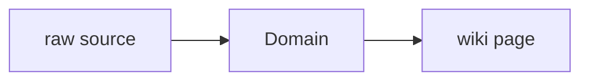

# Domain Knowledge Network

## Current Shape

- Registered raw sources:
- Connected wiki pages:
- Inbox sources waiting for ingest:

## How To Add Knowledge

- Web article: `python3 scripts/new_source.py --domain domain-slug --kind article --title "标题" --url "https://..."`
- Local file: `python3 scripts/new_source.py --domain domain-slug --kind paper --title "标题" --local-path "/absolute/path/to/file.pdf"`
- After adding sources, run `python3 scripts/rebuild_domain_network.py` and then `python3 scripts/rebuild_index.py`.

## Knowledge Map

## Source Intake

| Status | Kind | Title | Locator | Raw File |
| --- | --- | --- | --- | --- |
| inbox | article | Example | [web](https://example.com) | `raw/sources/domain/2026/example.md` |

## Wiki Knowledge Layer

| Type | Title | Summary | Wiki Page |
| --- | --- | --- | --- |
| concept | Example Concept | One-line summary | `wiki/concepts/example.md` |

## Next Network Actions

- Turn high-value `inbox` sources into source summaries.
- Promote recurring terms, methods, people, texts, tools, or datasets into concept/entity pages.
- Add explicit `Related` links between source summaries and concept pages, then rerun lint.
- Mark cross-disciplinary bridge candidates in the related pages instead of duplicating content across domains.

## Cross-Disciplinary Bridge Candidates

- 待补：
