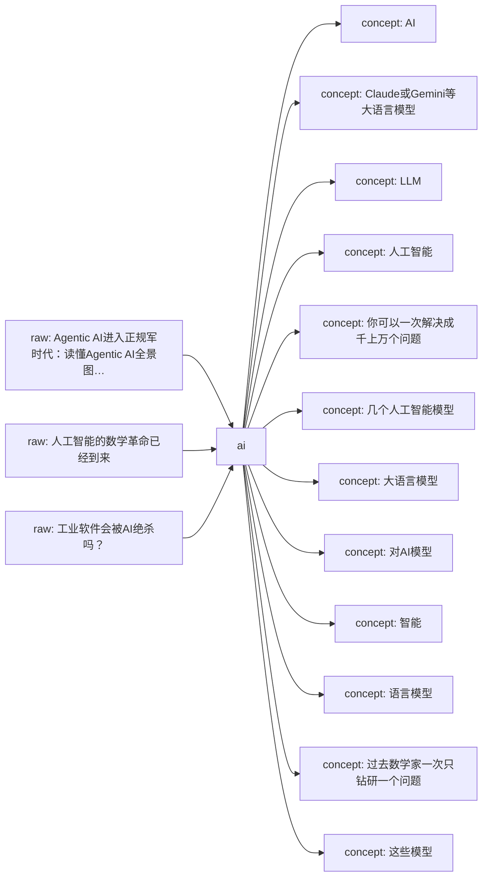
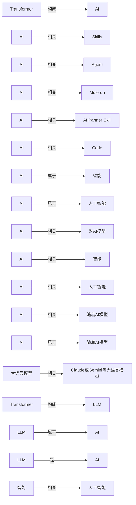

# ai Knowledge Network

这页是单学科知识网络的入口。它把原始资料、网页链接、本地资料位置、已沉淀的 wiki 页面和下一步待处理动作放在同一张可维护地图里。

## Current Shape

- Registered raw sources: 3
- Connected wiki pages: 16
- Inbox sources waiting for ingest: 0
- Generated on: 2026-06-19

## How To Add Knowledge

- Web article: `python3 scripts/new_source.py --domain ai --kind article --title "标题" --url "https://..."`
- Local file: `python3 scripts/new_source.py --domain ai --kind paper --title "标题" --local-path "/absolute/path/to/file.pdf"`
- After adding sources, run `python3 scripts/rebuild_domain_network.py` and then `python3 scripts/rebuild_index.py`.
- When a source is important, create or update a `wiki/sources/...` source summary and connect it to concept/entity/analysis pages.

## Knowledge Map

## Concept Graph

## Concept Relations

| Source Concept | Relation | Target Concept | Evidence |
| --- | --- | --- | --- |
| Transformer | 构成 | AI | [source](../sources/2026-06-17-对transformer的批判2-transformer能输出知识吗.md); evidence: 摘要：“泛BP+Transformer”构成了这一代AI基础架构，泛BP已经被诺贝尔奖封印而昭彰天下，却是个有数十年历史的“资深技术”，有深入理解的人都知道Transformer才是这个魔术的核心道具，LLM的真正“新动能”。 |
| AI | 相关 | Skills | [source](../sources/2026-06-17-agent-skills-终极指南-入门-精通-预测.md); evidence: 巧借通用 Agent 内核，只靠 Skills 设计，就能低成本创造具有通用 AI 智能上限的垂直 Agent 应用。 |
| AI | 相关 | Agent | [source](../sources/2026-06-17-agent-skills-终极指南-入门-精通-预测.md); evidence: 巧借通用 Agent 内核，只靠 Skills 设计，就能低成本创造具有通用 AI 智能上限的垂直 Agent 应用。 |
| AI | 相关 | Mulerun | [source](../sources/2026-06-17-agent-skills-终极指南-入门-精通-预测.md); evidence: 顺便给朋友宇森、付铖的 Mulerun 打个广，他们在做全球性的 Agent 开发与交易市场，即将支持 Creator 用 Skills 开发垂直 Agent，可被用户使用 or 被其他 AI 产品调用。 |
| AI | 相关 | AI Partner Skill | [source](../sources/2026-06-17-agent-skills-终极指南-入门-精通-预测.md); evidence: 又如 AI Partner Skill，让 通用 Agent 深度学习你的记忆，塑造懂你的 AI 伴侣，给到个性回应。 |
| AI | 相关 | Code | [source](../sources/2026-06-17-万字长文-claude-skills完全指南-从概念到实战.md); evidence: OpenAI的Codex CLI也采用了几乎一样的架构。 |
| AI | 属于 | 智能 | [source](../sources/2026-06-17-人工智能的数学革命已经到来.md); evidence: 自动补充：这份资料属于「AI」资料库，用于补强《人工智能的数学革命已经到来》相关的核心观点、概念证据和学科网络关系。 |
| AI | 属于 | 人工智能 | [source](../sources/2026-06-17-人工智能的数学革命已经到来.md); evidence: 自动补充：这份资料属于「AI」资料库，用于补强《人工智能的数学革命已经到来》相关的核心观点、概念证据和学科网络关系。 |
| AI | 相关 | 对AI模型 | [source](../sources/2026-06-17-人工智能的数学革命已经到来.md); evidence: " Terence Tao 对AI模型为数学家提供的机遇感到兴奋。 |
| AI | 相关 | 智能 | [source](../sources/2026-06-17-人工智能的数学革命已经到来.md); evidence: 普林斯顿高等研究院的 Akshay Venkatesh 认为，随着AI模型成 人工智能正以极快的速度被用来证明新的数学成果。 |
| AI | 相关 | 人工智能 | [source](../sources/2026-06-17-人工智能的数学革命已经到来.md); evidence: 普林斯顿高等研究院的 Akshay Venkatesh 认为，随着AI模型成 人工智能正以极快的速度被用来证明新的数学成果。 |
| AI | 相关 | 随着AI模型 | [source](../sources/2026-06-17-人工智能的数学革命已经到来.md); evidence: 普林斯顿高等研究院的 Akshay Venkatesh 认为，随着AI模型成 人工智能正以极快的速度被用来证明新的数学成果。 |
| AI | 属于 | 随着AI模型 | [source](../sources/2026-06-17-人工智能的数学革命已经到来.md); evidence: 普林斯顿高等研究院的 Akshay Venkatesh 认为，随着AI模型成 自动补充：这份资料属于「AI」资料库，用于补强《人工智能的数学革命已经到来》相关的核心观点、概念证据和学科网络关系。 |
| 大语言模型 | 相关 | Claude或Gemini等大语言模型 | [source](../sources/2026-06-17-人工智能的数学革命已经到来.md); evidence: 而在另一些情形中，与ChatGPT、Claude或Gemini等大语言模型的深入对话则催生了全新的证明思路。 |
| Transformer | 构成 | LLM | [source](../sources/2026-06-17-对transformer的批判2-transformer能输出知识吗.md); evidence: 摘要：“泛BP+Transformer”构成了这一代AI基础架构，泛BP已经被诺贝尔奖封印而昭彰天下，却是个有数十年历史的“资深技术”，有深入理解的人都知道Transformer才是这个魔术的核心道具，LLM的真正“新动能”。 |
| LLM | 属于 | AI | [source](../sources/2026-06-17-agentic-ai进入正规军时代-读懂agentic-ai全景图与畅想一人公司opc的未来.md); evidence: 如果说去年大家还在为大模型（LLM）的参数量狂欢，那今年整个技术圈的风向已经彻底变了，特别是近期小龙虾OpenClaw的火爆，言必称Agentic AI（代理式人工智能或智能… 自动补充：这份资料属于「ai」资料库，用于补强《Agenti… |
| LLM | 是 | AI | [source](../sources/2026-06-17-agentic-ai进入正规军时代-读懂agentic-ai全景图与畅想一人公司opc的未来.md); evidence: 如果说去年大家还在为大模型（LLM）的参数量狂欢，那今年整个技术圈的风向已经彻底变了，特别是近期小龙虾OpenClaw的火爆，言必称Agentic AI（代理式人工智能或智能体人工智能）。 |
| 智能 | 相关 | 人工智能 | [source](../sources/2026-06-17-人工智能的数学革命已经到来.md); evidence: 人工智能正以极快的速度被用来证明新的数学成果。 |
| 过去数学家一次只钻研一个问题 | 相关 | 你可以一次解决成千上万个问题 | [source](../sources/2026-06-17-人工智能的数学革命已经到来.md); evidence: 过去数学家一次只钻研一个问题，而"有了这些工具，你可以一次解决成千上万个问题，并开始做统计研究"。 |
| 智能 | 相关 | 几个人工智能模型 | [source](../sources/2026-06-17-人工智能的数学革命已经到来.md); evidence: 那年七月，几个人工智能模型在国际数学奥林匹克竞赛中解出了六道题中的五道。 |
| 大语言模型 | 相关 | 语言模型 | [source](../sources/2026-06-17-人工智能的数学革命已经到来.md); evidence: 而在另一些情形中，与ChatGPT、Claude或Gemini等大语言模型的深入对话则催生了全新的证明思路。 |

## Source Intake

| Status | Kind | Title | Locator | Raw File |
| --- | --- | --- | --- | --- |
| active | article | [Agentic AI进入正规军时代：读懂Agentic AI全景图与畅想一人公司OPC的未来](../../raw/sources/ai/2026/2026-06-17-agentic-ai进入正规军时代-读懂agentic-ai全景图与畅想一人公司opc的未来.md) | [web](https://mp.weixin.qq.com/s/jVcYKvy585KYzlbLOAb4HQ) | `raw/sources/ai/2026/2026-06-17-agentic-ai进入正规军时代-读懂agentic-ai全景图与畅想一人公司opc的未来.md` |
| active | article | [人工智能的数学革命已经到来](../../raw/sources/ai/2026/2026-06-17-人工智能的数学革命已经到来.md) | [web](https://mp.weixin.qq.com/s/cp246PJTaFZGQoPbbRFZew) | `raw/sources/ai/2026/2026-06-17-人工智能的数学革命已经到来.md` |
| active | article | [工业软件会被AI绝杀吗？](../../raw/sources/ai/2026/2026-06-17-工业软件会被ai绝杀吗.md) | [web](https://mp.weixin.qq.com/s/dTXLDOfRsvCq0LO8ar_VaQ) | `raw/sources/ai/2026/2026-06-17-工业软件会被ai绝杀吗.md` |

## Wiki Knowledge Layer

| Type | Title | Summary | Wiki Page |
| --- | --- | --- | --- |
| concept | [AI](../concepts/ai.md) | AI 是 ai 知识网络中已保留的概念页，当前定义基于入库资料证据和概念关系，可继续精炼边界与跨学科连接。 | `wiki/concepts/ai.md` |
| concept | [Claude或Gemini等大语言模型](../concepts/claude或gemini等大语言模型.md) | 从资料《人工智能的数学革命已经到来》自动提取的候选概念，等待人工整理定义、边界和跨学科连接。 | `wiki/concepts/claude或gemini等大语言模型.md` |
| concept | [LLM](../concepts/llm.md) | LLM 是 ai 知识网络中已保留的概念页，当前定义基于入库资料证据和概念关系，可继续精炼边界与跨学科连接。 | `wiki/concepts/llm.md` |
| concept | [人工智能](../concepts/人工智能.md) | 从资料《人工智能的数学革命已经到来》自动提取的候选概念，等待人工整理定义、边界和跨学科连接。 | `wiki/concepts/人工智能.md` |
| concept | [你可以一次解决成千上万个问题](../concepts/你可以一次解决成千上万个问题.md) | 从资料《人工智能的数学革命已经到来》自动提取的候选概念，等待人工整理定义、边界和跨学科连接。 | `wiki/concepts/你可以一次解决成千上万个问题.md` |
| concept | [几个人工智能模型](../concepts/几个人工智能模型.md) | 从资料《人工智能的数学革命已经到来》自动提取的候选概念，等待人工整理定义、边界和跨学科连接。 | `wiki/concepts/几个人工智能模型.md` |
| concept | [大语言模型](../concepts/大语言模型.md) | 从资料《对Transformer的批判2：Transformer能输出知识吗》自动提取的候选概念，等待人工整理定义、边界和跨学科连接。 | `wiki/concepts/大语言模型.md` |
| concept | [对AI模型](../concepts/对ai模型.md) | 从资料《人工智能的数学革命已经到来》自动提取的候选概念，等待人工整理定义、边界和跨学科连接。 | `wiki/concepts/对ai模型.md` |
| concept | [智能](../concepts/智能.md) | 从资料《人工智能的数学革命已经到来》自动提取的候选概念，等待人工整理定义、边界和跨学科连接。 | `wiki/concepts/智能.md` |
| concept | [语言模型](../concepts/语言模型.md) | 从资料《对Transformer的批判2：Transformer能输出知识吗》自动提取的候选概念，等待人工整理定义、边界和跨学科连接。 | `wiki/concepts/语言模型.md` |
| concept | [过去数学家一次只钻研一个问题](../concepts/过去数学家一次只钻研一个问题.md) | 从资料《人工智能的数学革命已经到来》自动提取的候选概念，等待人工整理定义、边界和跨学科连接。 | `wiki/concepts/过去数学家一次只钻研一个问题.md` |
| concept | [这些模型](../concepts/这些模型.md) | 从资料《人工智能的数学革命已经到来》自动提取的候选概念，等待人工整理定义、边界和跨学科连接。 | `wiki/concepts/这些模型.md` |
| concept | [随着AI模型](../concepts/随着ai模型.md) | 从资料《人工智能的数学革命已经到来》自动提取的候选概念，等待人工整理定义、边界和跨学科连接。 | `wiki/concepts/随着ai模型.md` |
| source | [Source - Agentic AI进入正规军时代：读懂Agentic AI全景图与畅想一人公司OPC的未来](../sources/2026-06-17-agentic-ai进入正规军时代-读懂agentic-ai全景图与畅想一人公司opc的未来.md) | 自动补充：这份资料属于「ai」资料库，用于补强《Agentic AI进入正规军时代：读懂Agentic AI全景图与畅想一人公司OPC的未来》相关的核心观点、概念证据和学科网络关系。 如果说去年大家还在为大模型（LLM）的参数量狂欢，那今年整个技术圈的风向已经彻底变了，特别是近期小龙虾OpenClaw的火爆，言必称Agentic AI（代理式人工智能或智能… | `wiki/sources/2026-06-17-agentic-ai进入正规军时代-读懂agentic-ai全景图与畅想一人公司opc的未来.md` |
| source | [Source - 人工智能的数学革命已经到来](../sources/2026-06-17-人工智能的数学革命已经到来.md) | 自动补充：这份资料属于「AI」资料库，用于补强《人工智能的数学革命已经到来》相关的核心观点、概念证据和学科网络关系。 人工智能正以极快的速度被用来证明新的数学成果。数学家们认为，这仅仅是个开始。 转折点出现在2025年夏天。那年七月，几个人工智能模型在国际数学奥林匹克竞赛中解出了六道题中的五道。这项年度赛事汇集了全球最顶尖的高中生。尽管数学家们对此感到震惊… | `wiki/sources/2026-06-17-人工智能的数学革命已经到来.md` |
| source | [Source - 工业软件会被AI绝杀吗？](../sources/2026-06-17-工业软件会被ai绝杀吗.md) | 已登记的ai资料，等待补充摘录或正文。 | `wiki/sources/2026-06-17-工业软件会被ai绝杀吗.md` |

## Next Network Actions

- Turn high-value `inbox` sources into source summaries.
- Promote recurring terms, methods, people, texts, tools, or datasets into concept/entity pages.
- Add explicit `Related` links between source summaries and concept pages, then rerun lint.
- Mark cross-disciplinary bridge candidates in the related pages instead of duplicating content across domains.

## Cross-Disciplinary Bridge Candidates

- 待补：这个学科中哪些概念需要连接到其他学科？
- 待补：哪些资料适合成为下一阶段跨学科 LLM Wiki 的桥接页面？
