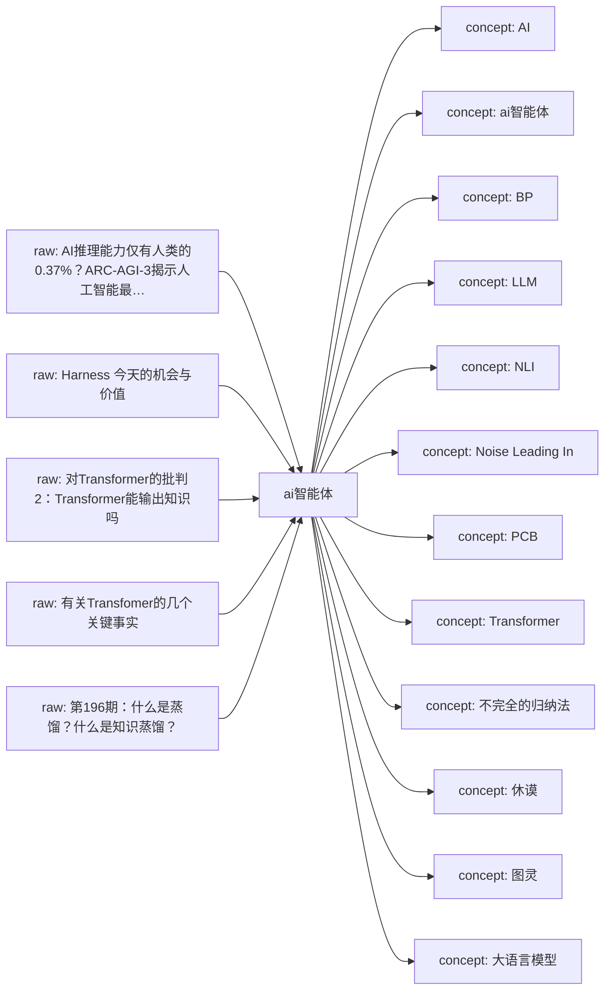
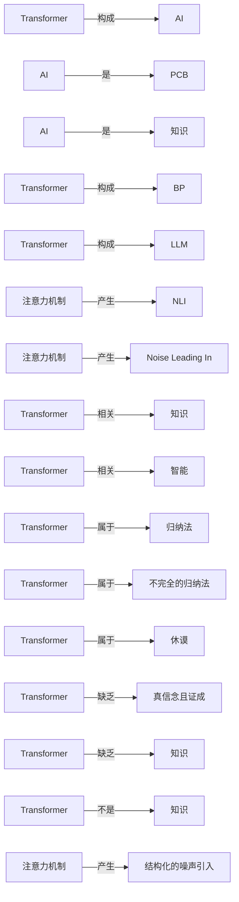

# ai智能体 Knowledge Network

这页是单学科知识网络的入口。它把原始资料、网页链接、本地资料位置、已沉淀的 wiki 页面和下一步待处理动作放在同一张可维护地图里。

## Current Shape

- Registered raw sources: 5
- Connected wiki pages: 27
- Inbox sources waiting for ingest: 0
- Generated on: 2026-06-17

## How To Add Knowledge

- Web article: `python3 scripts/new_source.py --domain ai智能体 --kind article --title "标题" --url "https://..."`
- Local file: `python3 scripts/new_source.py --domain ai智能体 --kind paper --title "标题" --local-path "/absolute/path/to/file.pdf"`
- After adding sources, run `python3 scripts/rebuild_domain_network.py` and then `python3 scripts/rebuild_index.py`.
- When a source is important, create or update a `wiki/sources/...` source summary and connect it to concept/entity/analysis pages.

## Knowledge Map

## Concept Graph

## Concept Relations

| Source Concept | Relation | Target Concept | Evidence |
| --- | --- | --- | --- |
| Transformer | 构成 | AI | [source](../sources/2026-06-17-对transformer的批判2-transformer能输出知识吗.md); evidence: 摘要：“泛BP+Transformer”构成了这一代AI基础架构，泛BP已经被诺贝尔奖封印而昭彰天下，却是个有数十年历史的“资深技术”，有深入理解的人都知道Transformer才是这个魔术的核心道具，LLM的真正“新动能”。 |
| AI | 是 | PCB | [source](../sources/2026-06-17-对transformer的批判2-transformer能输出知识吗.md); evidence: 这种所谓的定义，作为 工程师把握手上做的这块板子（PCB）或者这段代码，未必没有实际意义，但是作为AI的定义就太儿戏了。 |
| AI | 是 | 知识 | [source](../sources/2026-06-17-对transformer的批判2-transformer能输出知识吗.md); evidence: 知识作为创新的成果，是我们考察AI 的基本尺度。 |
| Transformer | 构成 | BP | [source](../sources/2026-06-17-对transformer的批判2-transformer能输出知识吗.md); evidence: 摘要：“泛BP+Transformer”构成了这一代AI基础架构，泛BP已经被诺贝尔奖封印而昭彰天下，却是个有数十年历史的“资深技术”，有深入理解的人都知道Transformer才是这个魔术的核心道具，LLM的真正“新动能”。 |
| Transformer | 构成 | LLM | [source](../sources/2026-06-17-对transformer的批判2-transformer能输出知识吗.md); evidence: 摘要：“泛BP+Transformer”构成了这一代AI基础架构，泛BP已经被诺贝尔奖封印而昭彰天下，却是个有数十年历史的“资深技术”，有深入理解的人都知道Transformer才是这个魔术的核心道具，LLM的真正“新动能”。 |
| 注意力机制 | 产生 | NLI | [source](../sources/2026-06-17-对transformer的批判2-transformer能输出知识吗.md); evidence: 文章首先揭示注意力机制在本质上是一种结构化的噪声引入（Noise Leading In, NLI）​ 过程，其产生的权重分配具有内在的不稳定性和偏性。 |
| 注意力机制 | 产生 | Noise Leading In | [source](../sources/2026-06-17-对transformer的批判2-transformer能输出知识吗.md); evidence: 文章首先揭示注意力机制在本质上是一种结构化的噪声引入（Noise Leading In, NLI）​ 过程，其产生的权重分配具有内在的不稳定性和偏性。 |
| Transformer | 相关 | 知识 | [source](../sources/2026-06-17-对transformer的批判2-transformer能输出知识吗.md); evidence: 我们必须认真考察Transformer的输出与知识的关系，然后才能够更深理解其与智能之间的关系。 |
| Transformer | 相关 | 智能 | [source](../sources/2026-06-17-对transformer的批判2-transformer能输出知识吗.md); evidence: 我们必须认真考察Transformer的输出与知识的关系，然后才能够更深理解其与智能之间的关系。 |
| Transformer | 属于 | 归纳法 | [source](../sources/2026-06-17-对transformer的批判2-transformer能输出知识吗.md); evidence: 其次，本文指出Transformer的工作机制属于不完全的归纳法，其结论建立在数据统计规律而非逻辑必然性之上，该问题在哲学上已被 休谟和波普尔进行了充分的批判论证。 |
| Transformer | 属于 | 不完全的归纳法 | [source](../sources/2026-06-17-对transformer的批判2-transformer能输出知识吗.md); evidence: 其次，本文指出Transformer的工作机制属于不完全的归纳法，其结论建立在数据统计规律而非逻辑必然性之上，该问题在哲学上已被 休谟和波普尔进行了充分的批判论证。 |
| Transformer | 属于 | 休谟 | [source](../sources/2026-06-17-对transformer的批判2-transformer能输出知识吗.md); evidence: 其次，本文指出Transformer的工作机制属于不完全的归纳法，其结论建立在数据统计规律而非逻辑必然性之上，该问题在哲学上已被 休谟和波普尔进行了充分的批判论证。 |
| Transformer | 缺乏 | 真信念且证成 | [source](../sources/2026-06-17-对transformer的批判2-transformer能输出知识吗.md); evidence: 最终，Transformer的输出是一种高度复杂的、数据驱动的信息结构，它缺乏知识所必需的“真信念且证成”等条件。 |
| Transformer | 缺乏 | 知识 | [source](../sources/2026-06-17-对transformer的批判2-transformer能输出知识吗.md); evidence: 最终，Transformer的输出是一种高度复杂的、数据驱动的信息结构，它缺乏知识所必需的“真信念且证成”等条件。 |
| Transformer | 不是 | 知识 | [source](../sources/2026-06-17-对transformer的批判2-transformer能输出知识吗.md); evidence: 因此，Transformer的输出的不是知识，我们应将其视为有价值的信息工具，而非知识的权威来源，并始终由人类认知主体承担最终的意义判定与责任。 |
| 注意力机制 | 产生 | 结构化的噪声引入 | [source](../sources/2026-06-17-对transformer的批判2-transformer能输出知识吗.md); evidence: 文章首先揭示注意力机制在本质上是一种结构化的噪声引入（Noise Leading In, NLI）​ 过程，其产生的权重分配具有内在的不稳定性和偏性。 |

## Source Intake

| Status | Kind | Title | Locator | Raw File |
| --- | --- | --- | --- | --- |
| active | article | [AI推理能力仅有人类的0.37%？ARC-AGI-3揭示人工智能最致命的盲区](../../raw/sources/ai智能体/2026/2026-06-17-ai推理能力仅有人类的0-37-arc-agi-3揭示人工智能最致命的盲区.md) | [web](https://mp.weixin.qq.com/s/-WjIzxr8xhms4CeXlbObVw) | `raw/sources/ai智能体/2026/2026-06-17-ai推理能力仅有人类的0-37-arc-agi-3揭示人工智能最致命的盲区.md` |
| active | article | [Harness 今天的机会与价值](../../raw/sources/ai智能体/2026/2026-06-17-harness-今天的机会与价值.md) | [web](https://mp.weixin.qq.com/s/FSnvyRDmkgXQzJtC-cwJGw) | `raw/sources/ai智能体/2026/2026-06-17-harness-今天的机会与价值.md` |
| active | paper | [对Transformer的批判2：Transformer能输出知识吗](../../raw/sources/ai智能体/2026/2026-06-17-对transformer的批判2-transformer能输出知识吗.md) | `/Users/Min369/Documents/同步空间/Manju/AIProjects/ResearchManjusi/LLM Wiki/raw/assets/uploads/ai智能体/2026/对transformer的批判2-transformer能输出知识吗.docx` | `raw/sources/ai智能体/2026/2026-06-17-对transformer的批判2-transformer能输出知识吗.md` |
| active | paper | [有关Transfomer的几个关键事实](../../raw/sources/ai智能体/2026/2026-06-17-有关transfomer的几个关键事实.md) | `/Users/Min369/Documents/同步空间/Manju/AIProjects/ResearchManjusi/LLM Wiki/raw/assets/uploads/ai智能体/2026/有关transfomer的几个关键事实-v3.docx` | `raw/sources/ai智能体/2026/2026-06-17-有关transfomer的几个关键事实.md` |
| active | article | [第196期：什么是蒸馏？什么是知识蒸馏？](../../raw/sources/ai智能体/2026/2026-06-17-第196期-什么是蒸馏-什么是知识蒸馏.md) | [web](https://mp.weixin.qq.com/s/mQL4ZQl82xng09vW2ipncQ) | `raw/sources/ai智能体/2026/2026-06-17-第196期-什么是蒸馏-什么是知识蒸馏.md` |

## Wiki Knowledge Layer

| Type | Title | Summary | Wiki Page |
| --- | --- | --- | --- |
| concept | [AI](../concepts/ai.md) | 从资料《对Transformer的批判2：Transformer能输出知识吗》自动提取的候选概念，等待人工整理定义、边界和跨学科连接。 | `wiki/concepts/ai.md` |
| concept | [ai智能体](../concepts/ai智能体.md) | 从资料《对Transformer的批判2：Transformer能输出知识吗》自动提取的候选概念，等待人工整理定义、边界和跨学科连接。 | `wiki/concepts/ai智能体.md` |
| concept | [BP](../concepts/bp.md) | 从资料《对Transformer的批判2：Transformer能输出知识吗》自动提取的候选概念，等待人工整理定义、边界和跨学科连接。 | `wiki/concepts/bp.md` |
| concept | [LLM](../concepts/llm.md) | 从资料《对Transformer的批判2：Transformer能输出知识吗》自动提取的候选概念，等待人工整理定义、边界和跨学科连接。 | `wiki/concepts/llm.md` |
| concept | [NLI](../concepts/nli.md) | 从资料《对Transformer的批判2：Transformer能输出知识吗》自动提取的候选概念，等待人工整理定义、边界和跨学科连接。 | `wiki/concepts/nli.md` |
| concept | [Noise Leading In](../concepts/noise-leading-in.md) | 从资料《对Transformer的批判2：Transformer能输出知识吗》自动提取的候选概念，等待人工整理定义、边界和跨学科连接。 | `wiki/concepts/noise-leading-in.md` |
| concept | [PCB](../concepts/pcb.md) | 从资料《对Transformer的批判2：Transformer能输出知识吗》自动提取的候选概念，等待人工整理定义、边界和跨学科连接。 | `wiki/concepts/pcb.md` |
| concept | [Transformer](../concepts/transformer.md) | 从资料《对Transformer的批判2：Transformer能输出知识吗》自动提取的候选概念，等待人工整理定义、边界和跨学科连接。 | `wiki/concepts/transformer.md` |
| concept | [不完全的归纳法](../concepts/不完全的归纳法.md) | 从资料《对Transformer的批判2：Transformer能输出知识吗》自动提取的候选概念，等待人工整理定义、边界和跨学科连接。 | `wiki/concepts/不完全的归纳法.md` |
| concept | [休谟](../concepts/休谟.md) | 从资料《对Transformer的批判2：Transformer能输出知识吗》自动提取的候选概念，等待人工整理定义、边界和跨学科连接。 | `wiki/concepts/休谟.md` |
| concept | [图灵](../concepts/图灵.md) | 从资料《对Transformer的批判2：Transformer能输出知识吗》自动提取的候选概念，等待人工整理定义、边界和跨学科连接。 | `wiki/concepts/图灵.md` |
| concept | [大语言模型](../concepts/大语言模型.md) | 从资料《对Transformer的批判2：Transformer能输出知识吗》自动提取的候选概念，等待人工整理定义、边界和跨学科连接。 | `wiki/concepts/大语言模型.md` |
| concept | [归纳法](../concepts/归纳法.md) | 从资料《对Transformer的批判2：Transformer能输出知识吗》自动提取的候选概念，等待人工整理定义、边界和跨学科连接。 | `wiki/concepts/归纳法.md` |
| concept | [智能](../concepts/智能.md) | 从资料《对Transformer的批判2：Transformer能输出知识吗》自动提取的候选概念，等待人工整理定义、边界和跨学科连接。 | `wiki/concepts/智能.md` |
| concept | [泛BP](../concepts/泛bp.md) | 从资料《对Transformer的批判2：Transformer能输出知识吗》自动提取的候选概念，等待人工整理定义、边界和跨学科连接。 | `wiki/concepts/泛bp.md` |
| concept | [波普尔](../concepts/波普尔.md) | 从资料《对Transformer的批判2：Transformer能输出知识吗》自动提取的候选概念，等待人工整理定义、边界和跨学科连接。 | `wiki/concepts/波普尔.md` |
| concept | [注意力机制](../concepts/注意力机制.md) | 从资料《对Transformer的批判2：Transformer能输出知识吗》自动提取的候选概念，等待人工整理定义、边界和跨学科连接。 | `wiki/concepts/注意力机制.md` |
| concept | [真信念且证成](../concepts/真信念且证成.md) | 从资料《对Transformer的批判2：Transformer能输出知识吗》自动提取的候选概念，等待人工整理定义、边界和跨学科连接。 | `wiki/concepts/真信念且证成.md` |
| concept | [知识](../concepts/知识.md) | 从资料《对Transformer的批判2：Transformer能输出知识吗》自动提取的候选概念，等待人工整理定义、边界和跨学科连接。 | `wiki/concepts/知识.md` |
| concept | [知识论](../concepts/知识论.md) | 从资料《对Transformer的批判2：Transformer能输出知识吗》自动提取的候选概念，等待人工整理定义、边界和跨学科连接。 | `wiki/concepts/知识论.md` |
| concept | [结构化的噪声引入](../concepts/结构化的噪声引入.md) | 从资料《对Transformer的批判2：Transformer能输出知识吗》自动提取的候选概念，等待人工整理定义、边界和跨学科连接。 | `wiki/concepts/结构化的噪声引入.md` |
| concept | [语言模型](../concepts/语言模型.md) | 从资料《对Transformer的批判2：Transformer能输出知识吗》自动提取的候选概念，等待人工整理定义、边界和跨学科连接。 | `wiki/concepts/语言模型.md` |
| source | [Source - AI推理能力仅有人类的0.37%？ARC-AGI-3揭示人工智能最致命的盲区](../sources/2026-06-17-ai推理能力仅有人类的0-37-arc-agi-3揭示人工智能最致命的盲区.md) | 一个悄然上线、没有任何头条新闻的测试，却让硅谷核心圈的很多人在深夜辗转难眠。 这个测试叫 ARC-AGI-3，2026年3月25日发布。它的结论只有一句话，却重如千钧： 当今世界上最强大的AI，面对全新环境的推理能力，只有人类的0.37%。 不是37%，是0.37%。 --- 一片凯歌中突然出现的"镜子" 过去两年，AI刷榜的速度近乎疯狂。今天某个模型登上… | `wiki/sources/2026-06-17-ai推理能力仅有人类的0-37-arc-agi-3揭示人工智能最致命的盲区.md` |
| source | [Source - Harness 今天的机会与价值](../sources/2026-06-17-harness-今天的机会与价值.md) | 摘要 Harness 已成为产业共识,前沿模型持续逼近静态智能天花板。在此条件下,Harness 的经济价值由「扩展能力上限」转向「保障执行下限」:同一任务上,其对模型成绩的边际贡献随模型变强而系统性收窄,常见任务由弱模型时代的约 30% 压缩至强模型时代的约 7% 更长、更动态、更安全的前沿任务与跨重复执行的一致性是 Harness 的长存价值。如 Op… | `wiki/sources/2026-06-17-harness-今天的机会与价值.md` |
| source | [Source - 对Transformer的批判2：Transformer能输出知识吗](../sources/2026-06-17-对transformer的批判2-transformer能输出知识吗.md) | Transformer的输出是知识吗？ 摘要：“泛BP+Transformer”构成了这一代AI基础架构，泛BP已经被诺贝尔奖封印而昭彰天下，却是个有数十年历史的“资深技术”，有深入理解的人都知道Transformer才是这个魔术的核心道具，LLM的真正“新动能”。批判不是批评，批评是负面的，而批判则是深刻洞察之后的判断。Transformer太重要了！我… | `wiki/sources/2026-06-17-对transformer的批判2-transformer能输出知识吗.md` |
| source | [Source - 有关Transfomer的几个关键事实](../sources/2026-06-17-有关transfomer的几个关键事实.md) | 对Transformer的批判1：有关Transformer的几个关键事实 摘要：本文从哲学与技术的交叉视角，阐述了有关Transformer的几个关键事实，系统批判了以Transformer架构为核心的大语言模型的根本局限性。文章指出，Transformer在本质上是一个“经验囚徒”，其能力严格受限于训练数据所定义的“过去”与“已知”范畴。批判从三个核心… | `wiki/sources/2026-06-17-有关transfomer的几个关键事实.md` |
| source | [Source - 第196期：什么是蒸馏？什么是知识蒸馏？](../sources/2026-06-17-第196期-什么是蒸馏-什么是知识蒸馏.md) | “ “ 鲸吞阅、精输出，内修外求，日拱一卒，慢慢变富。”——半亩云田 ” “ 普通的人改变结果，优秀的人改变原因，顶级高手改变模型 ”。 各位同学，大家好，我是你们的 老朋友Fisher。 你应该感觉到了，手机里的AI助手好像“ 开窍 ”了，比以前“聪明”点了。 以前，你问Siri、小爱同学“今天天气怎么样”，它要转圈、联网，有时候还答非所问。 现在，你断… | `wiki/sources/2026-06-17-第196期-什么是蒸馏-什么是知识蒸馏.md` |

## Next Network Actions

- Turn high-value `inbox` sources into source summaries.
- Promote recurring terms, methods, people, texts, tools, or datasets into concept/entity pages.
- Add explicit `Related` links between source summaries and concept pages, then rerun lint.
- Mark cross-disciplinary bridge candidates in the related pages instead of duplicating content across domains.

## Cross-Disciplinary Bridge Candidates

- 待补：这个学科中哪些概念需要连接到其他学科？
- 待补：哪些资料适合成为下一阶段跨学科 LLM Wiki 的桥接页面？
