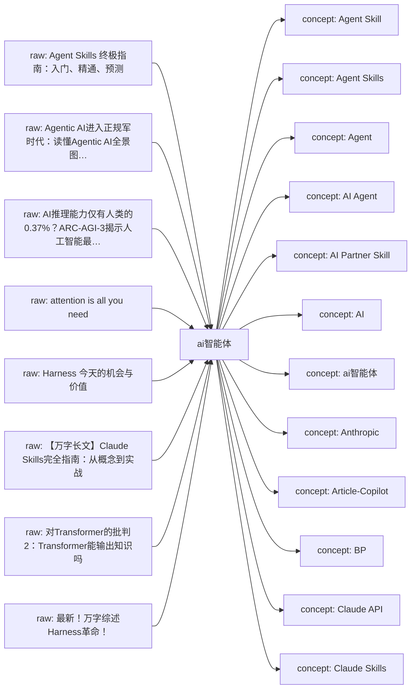
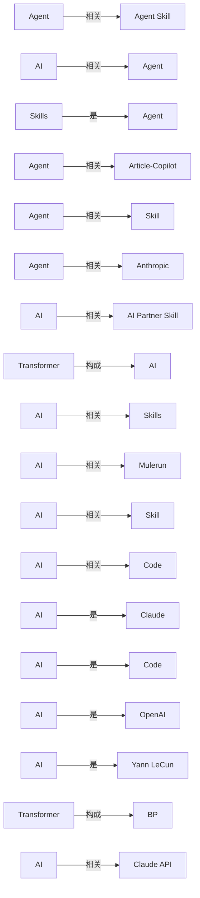

# ai智能体 Knowledge Network

这页是单学科知识网络的入口。它把原始资料、网页链接、本地资料位置、已沉淀的 wiki 页面和下一步待处理动作放在同一张可维护地图里。

## Current Shape

- Registered raw sources: 10
- Connected wiki pages: 54
- Inbox sources waiting for ingest: 1
- Generated on: 2026-06-19

## How To Add Knowledge

- Web article: `python3 scripts/new_source.py --domain ai智能体 --kind article --title "标题" --url "https://..."`
- Local file: `python3 scripts/new_source.py --domain ai智能体 --kind paper --title "标题" --local-path "/absolute/path/to/file.pdf"`
- After adding sources, run `python3 scripts/rebuild_domain_network.py` and then `python3 scripts/rebuild_index.py`.
- When a source is important, create or update a `wiki/sources/...` source summary and connect it to concept/entity/analysis pages.

## Knowledge Map

## Concept Graph

## Concept Relations

| Source Concept | Relation | Target Concept | Evidence |
| --- | --- | --- | --- |
| Agent | 相关 | Agent Skill | [source](../sources/2026-06-17-agent-skills-终极指南-入门-精通-预测.md); evidence: 在研读 Anthropic 官方技术博客，与持续 Agent Skill 实验之后，形成了 这份全网最完整的 Skill 指南 ，包含： 1. |
| AI | 相关 | Agent | [source](../sources/2026-06-17-agent-skills-终极指南-入门-精通-预测.md); evidence: 巧借通用 Agent 内核，只靠 Skills 设计，就能低成本创造具有通用 AI 智能上限的垂直 Agent 应用。 |
| Skills | 是 | Agent | [source](../sources/2026-06-17-agent-skills-终极指南-入门-精通-预测.md); evidence: 顺便给朋友宇森、付铖的 Mulerun 打个广，他们在做全球性的 Agent 开发与交易市场，即将支持 Crea… 🎐 卷首语 应该是全网最好的 Skills 中文指南与教程 ，全文 1. |
| Agent | 相关 | Article-Copilot | [source](../sources/2026-06-17-agent-skills-终极指南-入门-精通-预测.md); evidence: 比如我自己做的 Article-Copilot，一个 skill 就实现了从素材处理到正文写作的 Agent 应用 |
| Agent | 相关 | Skill | [source](../sources/2026-06-17-agent-skills-终极指南-入门-精通-预测.md); evidence: 在研读 Anthropic 官方技术博客，与持续 Agent Skill 实验之后，形成了 这份全网最完整的 Skill 指南 ，包含： 1. |
| Agent | 相关 | Anthropic | [source](../sources/2026-06-17-agent-skills-终极指南-入门-精通-预测.md); evidence: 在研读 Anthropic 官方技术博客，与持续 Agent Skill 实验之后，形成了 这份全网最完整的 Skill 指南 ，包含： 1. |
| AI | 相关 | AI Partner Skill | [source](../sources/2026-06-17-agent-skills-终极指南-入门-精通-预测.md); evidence: 又如 AI Partner Skill，让 通用 Agent 深度学习你的记忆，塑造懂你的 AI 伴侣，给到个性回应。 |
| Transformer | 构成 | AI | [source](../sources/2026-06-17-对transformer的批判2-transformer能输出知识吗.md); evidence: 摘要：“泛BP+Transformer”构成了这一代AI基础架构，泛BP已经被诺贝尔奖封印而昭彰天下，却是个有数十年历史的“资深技术”，有深入理解的人都知道Transformer才是这个魔术的核心道具，LLM的真正“新动能”。 |
| AI | 相关 | Skills | [source](../sources/2026-06-17-agent-skills-终极指南-入门-精通-预测.md); evidence: 巧借通用 Agent 内核，只靠 Skills 设计，就能低成本创造具有通用 AI 智能上限的垂直 Agent 应用。 |
| AI | 相关 | Mulerun | [source](../sources/2026-06-17-agent-skills-终极指南-入门-精通-预测.md); evidence: 顺便给朋友宇森、付铖的 Mulerun 打个广，他们在做全球性的 Agent 开发与交易市场，即将支持 Creator 用 Skills 开发垂直 Agent，可被用户使用 or 被其他 AI 产品调用。 |
| AI | 相关 | Skill | [source](../sources/2026-06-17-agent-skills-终极指南-入门-精通-预测.md); evidence: 一个好 Skill 能发挥的智能效果，甚至能轻松等同、超越完整的 AI 产品。 |
| AI | 相关 | Code | [source](../sources/2026-06-17-万字长文-claude-skills完全指南-从概念到实战.md); evidence: OpenAI的Codex CLI也采用了几乎一样的架构。 |
| AI | 是 | Claude | [source](../sources/2026-06-17-万字长文-claude-skills完全指南-从概念到实战.md); evidence: 用Claude Code自己构建Skills的人是一小撮，但想用AI解决实际问题、又没能力从零创建工作流的人，才是更大的群体。 |
| AI | 是 | Code | [source](../sources/2026-06-17-万字长文-claude-skills完全指南-从概念到实战.md); evidence: 用Claude Code自己构建Skills的人是一小撮，但想用AI解决实际问题、又没能力从零创建工作流的人，才是更大的群体。 |
| AI | 是 | OpenAI | [source](../sources/2026-06-17-全面解析-世界模型-定义-路线-实践与agi的更近一步.md); evidence: 而为了解决这个问题，OpenAI、谷歌、微软等大公司，Yann LeCun、李飞飞等顶尖学者都开始抢着研究同一件事，那就是——世界模型。 |
| AI | 是 | Yann LeCun | [source](../sources/2026-06-17-全面解析-世界模型-定义-路线-实践与agi的更近一步.md); evidence: 而为了解决这个问题，OpenAI、谷歌、微软等大公司，Yann LeCun、李飞飞等顶尖学者都开始抢着研究同一件事，那就是——世界模型。 |
| Transformer | 构成 | BP | [source](../sources/2026-06-17-对transformer的批判2-transformer能输出知识吗.md); evidence: 摘要：“泛BP+Transformer”构成了这一代AI基础架构，泛BP已经被诺贝尔奖封印而昭彰天下，却是个有数十年历史的“资深技术”，有深入理解的人都知道Transformer才是这个魔术的核心道具，LLM的真正“新动能”。 |
| AI | 相关 | Claude API | [source](../sources/2026-06-17-万字长文-claude-skills完全指南-从概念到实战.md); evidence: 如果你用Claude Code、Claude API，或者对AI Agent感兴趣，这篇文章应该对你有用。 |
| Skills | 是 | Claude Skills | [source](../sources/2026-06-17-agent-skills-终极指南-入门-精通-预测.md); evidence: @ 一泽Eze Claude Skills 的价值，还是被大大低估了。 |
| AI | 相关 | Claude | [source](../sources/2026-06-17-万字长文-claude-skills完全指南-从概念到实战.md); evidence: 如果你用Claude Code、Claude API，或者对AI Agent感兴趣，这篇文章应该对你有用。 |
| Skills | 是 | Crea | [source](../sources/2026-06-17-agent-skills-终极指南-入门-精通-预测.md); evidence: 顺便给朋友宇森、付铖的 Mulerun 打个广，他们在做全球性的 Agent 开发与交易市场，即将支持 Crea… 🎐 卷首语 应该是全网最好的 Skills 中文指南与教程 ，全文 1. |
| Transformer | 构成 | LLM | [source](../sources/2026-06-17-对transformer的批判2-transformer能输出知识吗.md); evidence: 摘要：“泛BP+Transformer”构成了这一代AI基础架构，泛BP已经被诺贝尔奖封印而昭彰天下，却是个有数十年历史的“资深技术”，有深入理解的人都知道Transformer才是这个魔术的核心道具，LLM的真正“新动能”。 |
| Skills | 是 | Mulerun | [source](../sources/2026-06-17-agent-skills-终极指南-入门-精通-预测.md); evidence: 顺便给朋友宇森、付铖的 Mulerun 打个广，他们在做全球性的 Agent 开发与交易市场，即将支持 Crea… 🎐 卷首语 应该是全网最好的 Skills 中文指南与教程 ，全文 1. |
| 注意力机制 | 产生 | NLI | [source](../sources/2026-06-17-对transformer的批判2-transformer能输出知识吗.md); evidence: 文章首先揭示注意力机制在本质上是一种结构化的噪声引入（Noise Leading In, NLI）​ 过程，其产生的权重分配具有内在的不稳定性和偏性。 |
| 注意力机制 | 产生 | Noise Leading In | [source](../sources/2026-06-17-对transformer的批判2-transformer能输出知识吗.md); evidence: 文章首先揭示注意力机制在本质上是一种结构化的噪声引入（Noise Leading In, NLI）​ 过程，其产生的权重分配具有内在的不稳定性和偏性。 |
| AI | 是 | PCB | [source](../sources/2026-06-17-对transformer的批判2-transformer能输出知识吗.md); evidence: 这种所谓的定义，作为 工程师把握手上做的这块板子（PCB）或者这段代码，未必没有实际意义，但是作为AI的定义就太儿戏了。 |
| Skills | 是 | Skill | [source](../sources/2026-06-17-agent-skills-终极指南-入门-精通-预测.md); evidence: 🎐 卷首语 应该是全网最好的 Skills 中文指南与教程 ，全文 1. |
| Skills | 相关 | Skill | [source](../sources/2026-06-17-agent-skills-终极指南-入门-精通-预测.md); evidence: 2w 字，包含了我对 Skills 的完整应用思考。 |
| Skills | 属于 | Skill | [source](../sources/2026-06-17-agent-skills-终极指南-入门-精通-预测.md); evidence: 任何不懂技术的人，都能开发属于自己的 Skills。 |
| Transformer | 属于 | 不完全的归纳法 | [source](../sources/2026-06-17-对transformer的批判2-transformer能输出知识吗.md); evidence: 其次，本文指出Transformer的工作机制属于不完全的归纳法，其结论建立在数据统计规律而非逻辑必然性之上，该问题在哲学上已被 休谟和波普尔进行了充分的批判论证。 |

## Source Intake

| Status | Kind | Title | Locator | Raw File |
| --- | --- | --- | --- | --- |
| active | article | [Agent Skills 终极指南：入门、精通、预测](../../raw/sources/ai智能体/2026/2026-06-17-agent-skills-终极指南-入门-精通-预测.md) | [web](https://mp.weixin.qq.com/s/jUylk813LYbKw0sLiIttTQ) | `raw/sources/ai智能体/2026/2026-06-17-agent-skills-终极指南-入门-精通-预测.md` |
| inbox | article | [Agentic AI进入正规军时代：读懂Agentic AI全景图与畅想一人公司OPC的未来](../../raw/sources/ai智能体/2026/2026-06-17-agentic-ai进入正规军时代-读懂agentic-ai全景图与畅想一人公司opc的未来.md) | [web](https://mp.weixin.qq.com/s/jVcYKvy585KYzlbLOAb4HQ) | `raw/sources/ai智能体/2026/2026-06-17-agentic-ai进入正规军时代-读懂agentic-ai全景图与畅想一人公司opc的未来.md` |
| active | article | [AI推理能力仅有人类的0.37%？ARC-AGI-3揭示人工智能最致命的盲区](../../raw/sources/ai智能体/2026/2026-06-17-ai推理能力仅有人类的0-37-arc-agi-3揭示人工智能最致命的盲区.md) | [web](https://mp.weixin.qq.com/s/-WjIzxr8xhms4CeXlbObVw) | `raw/sources/ai智能体/2026/2026-06-17-ai推理能力仅有人类的0-37-arc-agi-3揭示人工智能最致命的盲区.md` |
| active | paper | [attention is all you need](../../raw/sources/ai智能体/2026/2026-06-17-attention-is-all-you-need.md) | 未登记 | `raw/sources/ai智能体/2026/2026-06-17-attention-is-all-you-need.md` |
| active | article | [Harness 今天的机会与价值](../../raw/sources/ai智能体/2026/2026-06-17-harness-今天的机会与价值.md) | [web](https://mp.weixin.qq.com/s/FSnvyRDmkgXQzJtC-cwJGw) | `raw/sources/ai智能体/2026/2026-06-17-harness-今天的机会与价值.md` |
| active | article | [【万字长文】Claude Skills完全指南：从概念到实战](../../raw/sources/ai智能体/2026/2026-06-17-万字长文-claude-skills完全指南-从概念到实战.md) | [web](https://mp.weixin.qq.com/s/x9UpqjuYzLb7I2ZZ932bNg) | `raw/sources/ai智能体/2026/2026-06-17-万字长文-claude-skills完全指南-从概念到实战.md` |
| active | paper | [对Transformer的批判2：Transformer能输出知识吗](../../raw/sources/ai智能体/2026/2026-06-17-对transformer的批判2-transformer能输出知识吗.md) | `/Users/Min369/Documents/同步空间/Manju/AIProjects/ResearchManjusi/LLM Wiki/raw/assets/uploads/ai智能体/2026/对transformer的批判2-transformer能输出知识吗.docx` | `raw/sources/ai智能体/2026/2026-06-17-对transformer的批判2-transformer能输出知识吗.md` |
| active | article | [最新！万字综述Harness革命！](../../raw/sources/ai智能体/2026/2026-06-17-最新-万字综述harness革命.md) | [web](https://mp.weixin.qq.com/s/0CTwb4aEr5mWwsdRdwzwkw) | `raw/sources/ai智能体/2026/2026-06-17-最新-万字综述harness革命.md` |
| active | paper | [有关Transfomer的几个关键事实](../../raw/sources/ai智能体/2026/2026-06-17-有关transfomer的几个关键事实.md) | `/Users/Min369/Documents/同步空间/Manju/AIProjects/ResearchManjusi/LLM Wiki/raw/assets/uploads/ai智能体/2026/有关transfomer的几个关键事实-v3.docx` | `raw/sources/ai智能体/2026/2026-06-17-有关transfomer的几个关键事实.md` |
| active | article | [第196期：什么是蒸馏？什么是知识蒸馏？](../../raw/sources/ai智能体/2026/2026-06-17-第196期-什么是蒸馏-什么是知识蒸馏.md) | [web](https://mp.weixin.qq.com/s/mQL4ZQl82xng09vW2ipncQ) | `raw/sources/ai智能体/2026/2026-06-17-第196期-什么是蒸馏-什么是知识蒸馏.md` |

## Wiki Knowledge Layer

| Type | Title | Summary | Wiki Page |
| --- | --- | --- | --- |
| concept | [Agent Skill](../concepts/agent-skill.md) | 从资料《Agent Skills 终极指南：入门、精通、预测》自动提取的候选概念，等待人工整理定义、边界和跨学科连接。 | `wiki/concepts/agent-skill.md` |
| concept | [Agent Skills](../concepts/agent-skills.md) | 从资料《Agent Skills 终极指南：入门、精通、预测》自动提取的候选概念，等待人工整理定义、边界和跨学科连接。 | `wiki/concepts/agent-skills.md` |
| concept | [Agent](../concepts/agent.md) | 从资料《Agent Skills 终极指南：入门、精通、预测》自动提取的候选概念，等待人工整理定义、边界和跨学科连接。 | `wiki/concepts/agent.md` |
| concept | [AI Agent](../concepts/ai-agent.md) | 从资料《Agent Skills 终极指南：入门、精通、预测》自动提取的候选概念，等待人工整理定义、边界和跨学科连接。 | `wiki/concepts/ai-agent.md` |
| concept | [AI Partner Skill](../concepts/ai-partner-skill.md) | 从资料《Agent Skills 终极指南：入门、精通、预测》自动提取的候选概念，等待人工整理定义、边界和跨学科连接。 | `wiki/concepts/ai-partner-skill.md` |
| concept | [AI](../concepts/ai.md) | AI 是 ai 知识网络中已保留的概念页，当前定义基于入库资料证据和概念关系，可继续精炼边界与跨学科连接。 | `wiki/concepts/ai.md` |
| concept | [ai智能体](../concepts/ai智能体.md) | 从资料《对Transformer的批判2：Transformer能输出知识吗》自动提取的候选概念，等待人工整理定义、边界和跨学科连接。 | `wiki/concepts/ai智能体.md` |
| concept | [Anthropic](../concepts/anthropic.md) | 从资料《Agent Skills 终极指南：入门、精通、预测》自动提取的候选概念，等待人工整理定义、边界和跨学科连接。 | `wiki/concepts/anthropic.md` |
| concept | [Article-Copilot](../concepts/article-copilot.md) | 从资料《Agent Skills 终极指南：入门、精通、预测》自动提取的候选概念，等待人工整理定义、边界和跨学科连接。 | `wiki/concepts/article-copilot.md` |
| concept | [BP](../concepts/bp.md) | 从资料《对Transformer的批判2：Transformer能输出知识吗》自动提取的候选概念，等待人工整理定义、边界和跨学科连接。 | `wiki/concepts/bp.md` |
| concept | [Claude API](../concepts/claude-api.md) | 从资料《【万字长文】Claude Skills完全指南：从概念到实战》自动提取的候选概念，等待人工整理定义、边界和跨学科连接。 | `wiki/concepts/claude-api.md` |
| concept | [Claude Skills](../concepts/claude-skills.md) | 从资料《Agent Skills 终极指南：入门、精通、预测》自动提取的候选概念，等待人工整理定义、边界和跨学科连接。 | `wiki/concepts/claude-skills.md` |
| concept | [Claude](../concepts/claude.md) | 从资料《【万字长文】Claude Skills完全指南：从概念到实战》自动提取的候选概念，等待人工整理定义、边界和跨学科连接。 | `wiki/concepts/claude.md` |
| concept | [Code](../concepts/code.md) | 从资料《【万字长文】Claude Skills完全指南：从概念到实战》自动提取的候选概念，等待人工整理定义、边界和跨学科连接。 | `wiki/concepts/code.md` |
| concept | [Crea](../concepts/crea.md) | 从资料《Agent Skills 终极指南：入门、精通、预测》自动提取的候选概念，等待人工整理定义、边界和跨学科连接。 | `wiki/concepts/crea.md` |
| concept | [Creator](../concepts/creator.md) | 从资料《Agent Skills 终极指南：入门、精通、预测》自动提取的候选概念，等待人工整理定义、边界和跨学科连接。 | `wiki/concepts/creator.md` |
| concept | [Cursor](../concepts/cursor.md) | 从资料《Agent Skills 终极指南：入门、精通、预测》自动提取的候选概念，等待人工整理定义、边界和跨学科连接。 | `wiki/concepts/cursor.md` |
| concept | [Github](../concepts/github.md) | 从资料《Agent Skills 终极指南：入门、精通、预测》自动提取的候选概念，等待人工整理定义、边界和跨学科连接。 | `wiki/concepts/github.md` |
| concept | [LLM](../concepts/llm.md) | LLM 是 ai 知识网络中已保留的概念页，当前定义基于入库资料证据和概念关系，可继续精炼边界与跨学科连接。 | `wiki/concepts/llm.md` |
| concept | [MCP](../concepts/mcp.md) | 从资料《Agent Skills 终极指南：入门、精通、预测》自动提取的候选概念，等待人工整理定义、边界和跨学科连接。 | `wiki/concepts/mcp.md` |
| concept | [Mulerun](../concepts/mulerun.md) | 从资料《Agent Skills 终极指南：入门、精通、预测》自动提取的候选概念，等待人工整理定义、边界和跨学科连接。 | `wiki/concepts/mulerun.md` |
| concept | [NLI](../concepts/nli.md) | 从资料《对Transformer的批判2：Transformer能输出知识吗》自动提取的候选概念，等待人工整理定义、边界和跨学科连接。 | `wiki/concepts/nli.md` |
| concept | [Noise Leading In](../concepts/noise-leading-in.md) | 从资料《对Transformer的批判2：Transformer能输出知识吗》自动提取的候选概念，等待人工整理定义、边界和跨学科连接。 | `wiki/concepts/noise-leading-in.md` |
| concept | [OpenAI](../concepts/openai.md) | 从资料《Agent Skills 终极指南：入门、精通、预测》自动提取的候选概念，等待人工整理定义、边界和跨学科连接。 | `wiki/concepts/openai.md` |
| concept | [Part](../concepts/part.md) | 从资料《【万字长文】Claude Skills完全指南：从概念到实战》自动提取的候选概念，等待人工整理定义、边界和跨学科连接。 | `wiki/concepts/part.md` |
| concept | [PCB](../concepts/pcb.md) | 从资料《对Transformer的批判2：Transformer能输出知识吗》自动提取的候选概念，等待人工整理定义、边界和跨学科连接。 | `wiki/concepts/pcb.md` |
| concept | [Simon](../concepts/simon.md) | 从资料《【万字长文】Claude Skills完全指南：从概念到实战》自动提取的候选概念，等待人工整理定义、边界和跨学科连接。 | `wiki/concepts/simon.md` |
| concept | [Skill](../concepts/skill.md) | Skill 是 AI Agent 可按需加载的单个能力包，用来封装某类任务的说明、流程、脚本和资源。 | `wiki/concepts/skill.md` |
| concept | [Skills](../concepts/skills.md) | Skills 是 AI Agent 可按需加载的能力包，用来把某类任务的说明、流程、脚本和资源封装成稳定的执行能力。 | `wiki/concepts/skills.md` |
| concept | [Transformer](../concepts/transformer.md) | 从资料《对Transformer的批判2：Transformer能输出知识吗》自动提取的候选概念，等待人工整理定义、边界和跨学科连接。 | `wiki/concepts/transformer.md` |
| concept | [VS Code](../concepts/vs-code.md) | 从资料《Agent Skills 终极指南：入门、精通、预测》自动提取的候选概念，等待人工整理定义、边界和跨学科连接。 | `wiki/concepts/vs-code.md` |
| concept | [不完全的归纳法](../concepts/不完全的归纳法.md) | 从资料《对Transformer的批判2：Transformer能输出知识吗》自动提取的候选概念，等待人工整理定义、边界和跨学科连接。 | `wiki/concepts/不完全的归纳法.md` |
| concept | [休谟](../concepts/休谟.md) | 从资料《对Transformer的批判2：Transformer能输出知识吗》自动提取的候选概念，等待人工整理定义、边界和跨学科连接。 | `wiki/concepts/休谟.md` |
| concept | [图灵](../concepts/图灵.md) | 从资料《对Transformer的批判2：Transformer能输出知识吗》自动提取的候选概念，等待人工整理定义、边界和跨学科连接。 | `wiki/concepts/图灵.md` |
| concept | [大语言模型](../concepts/大语言模型.md) | 从资料《对Transformer的批判2：Transformer能输出知识吗》自动提取的候选概念，等待人工整理定义、边界和跨学科连接。 | `wiki/concepts/大语言模型.md` |
| concept | [归纳法](../concepts/归纳法.md) | 从资料《对Transformer的批判2：Transformer能输出知识吗》自动提取的候选概念，等待人工整理定义、边界和跨学科连接。 | `wiki/concepts/归纳法.md` |
| concept | [泛BP](../concepts/泛bp.md) | 从资料《对Transformer的批判2：Transformer能输出知识吗》自动提取的候选概念，等待人工整理定义、边界和跨学科连接。 | `wiki/concepts/泛bp.md` |
| concept | [波普尔](../concepts/波普尔.md) | 从资料《对Transformer的批判2：Transformer能输出知识吗》自动提取的候选概念，等待人工整理定义、边界和跨学科连接。 | `wiki/concepts/波普尔.md` |
| concept | [注意力机制](../concepts/注意力机制.md) | 从资料《对Transformer的批判2：Transformer能输出知识吗》自动提取的候选概念，等待人工整理定义、边界和跨学科连接。 | `wiki/concepts/注意力机制.md` |
| concept | [真信念且证成](../concepts/真信念且证成.md) | 从资料《对Transformer的批判2：Transformer能输出知识吗》自动提取的候选概念，等待人工整理定义、边界和跨学科连接。 | `wiki/concepts/真信念且证成.md` |
| concept | [知识](../concepts/知识.md) | 从资料《对Transformer的批判2：Transformer能输出知识吗》自动提取的候选概念，等待人工整理定义、边界和跨学科连接。 | `wiki/concepts/知识.md` |
| concept | [知识论](../concepts/知识论.md) | 从资料《对Transformer的批判2：Transformer能输出知识吗》自动提取的候选概念，等待人工整理定义、边界和跨学科连接。 | `wiki/concepts/知识论.md` |
| concept | [结构化的噪声引入](../concepts/结构化的噪声引入.md) | 从资料《对Transformer的批判2：Transformer能输出知识吗》自动提取的候选概念，等待人工整理定义、边界和跨学科连接。 | `wiki/concepts/结构化的噪声引入.md` |
| concept | [语言模型](../concepts/语言模型.md) | 从资料《对Transformer的批判2：Transformer能输出知识吗》自动提取的候选概念，等待人工整理定义、边界和跨学科连接。 | `wiki/concepts/语言模型.md` |
| concept | [运作机制](../concepts/运作机制.md) | 从资料《Agent Skills 终极指南：入门、精通、预测》自动提取的候选概念，等待人工整理定义、边界和跨学科连接。 | `wiki/concepts/运作机制.md` |
| source | [Source - Agent Skills 终极指南：入门、精通、预测](../sources/2026-06-17-agent-skills-终极指南-入门-精通-预测.md) | 🎐 卷首语 应该是全网最好的 Skills 中文指南与教程 ，全文 1.2w 字，包含了我对 Skills 的完整应用思考。 巧借通用 Agent 内核，只靠 Skills 设计，就能低成本创造具有通用 AI 智能上限的垂直 Agent 应用。 顺便给朋友宇森、付铖的 Mulerun 打个广，他们在做全球性的 Agent 开发与交易市场，即将支持 Crea… | `wiki/sources/2026-06-17-agent-skills-终极指南-入门-精通-预测.md` |
| source | [Source - AI推理能力仅有人类的0.37%？ARC-AGI-3揭示人工智能最致命的盲区](../sources/2026-06-17-ai推理能力仅有人类的0-37-arc-agi-3揭示人工智能最致命的盲区.md) | 一个悄然上线、没有任何头条新闻的测试，却让硅谷核心圈的很多人在深夜辗转难眠。 这个测试叫 ARC-AGI-3，2026年3月25日发布。它的结论只有一句话，却重如千钧： 当今世界上最强大的AI，面对全新环境的推理能力，只有人类的0.37%。 不是37%，是0.37%。 --- 一片凯歌中突然出现的"镜子" 过去两年，AI刷榜的速度近乎疯狂。今天某个模型登上… | `wiki/sources/2026-06-17-ai推理能力仅有人类的0-37-arc-agi-3揭示人工智能最致命的盲区.md` |
| source | [Source - attention is all you need](../sources/2026-06-17-attention-is-all-you-need.md) | Sciverse 学术检索导入，用于补强当前知识网络的论文证据。 The dominant sequence transduction models are based on complex recurrent or convolutional neural networks in an encoder-decoder configuration. The… | `wiki/sources/2026-06-17-attention-is-all-you-need.md` |
| source | [Source - Harness 今天的机会与价值](../sources/2026-06-17-harness-今天的机会与价值.md) | 摘要 Harness 已成为产业共识,前沿模型持续逼近静态智能天花板。在此条件下,Harness 的经济价值由「扩展能力上限」转向「保障执行下限」:同一任务上,其对模型成绩的边际贡献随模型变强而系统性收窄,常见任务由弱模型时代的约 30% 压缩至强模型时代的约 7% 更长、更动态、更安全的前沿任务与跨重复执行的一致性是 Harness 的长存价值。如 Op… | `wiki/sources/2026-06-17-harness-今天的机会与价值.md` |
| source | [Source - 【万字长文】Claude Skills完全指南：从概念到实战](../sources/2026-06-17-万字长文-claude-skills完全指南-从概念到实战.md) | 1万字，国内最完整的Skills指南。想了解Skills是什么、怎么用、怎么建，看这一篇就够了。 内容很长，建议先点赞、收藏再慢慢读～ 说起来，Skills这个功能我关注挺久了。 去年10月Anthropic发布Skills的时候，我的判断是：这东西会火，但还早。 三个月过去，情况完全不一样了。 2025年12月，Anthropic把Skills做成了开放… | `wiki/sources/2026-06-17-万字长文-claude-skills完全指南-从概念到实战.md` |
| source | [Source - 对Transformer的批判2：Transformer能输出知识吗](../sources/2026-06-17-对transformer的批判2-transformer能输出知识吗.md) | Transformer的输出是知识吗？ 摘要：“泛BP+Transformer”构成了这一代AI基础架构，泛BP已经被诺贝尔奖封印而昭彰天下，却是个有数十年历史的“资深技术”，有深入理解的人都知道Transformer才是这个魔术的核心道具，LLM的真正“新动能”。批判不是批评，批评是负面的，而批判则是深刻洞察之后的判断。Transformer太重要了！我… | `wiki/sources/2026-06-17-对transformer的批判2-transformer能输出知识吗.md` |
| source | [Source - 最新！万字综述Harness革命！](../sources/2026-06-17-最新-万字综述harness革命.md) | 已登记的ai智能体资料，等待补充摘录或正文。 | `wiki/sources/2026-06-17-最新-万字综述harness革命.md` |
| source | [Source - 有关Transfomer的几个关键事实](../sources/2026-06-17-有关transfomer的几个关键事实.md) | 对Transformer的批判1：有关Transformer的几个关键事实 摘要：本文从哲学与技术的交叉视角，阐述了有关Transformer的几个关键事实，系统批判了以Transformer架构为核心的大语言模型的根本局限性。文章指出，Transformer在本质上是一个“经验囚徒”，其能力严格受限于训练数据所定义的“过去”与“已知”范畴。批判从三个核心… | `wiki/sources/2026-06-17-有关transfomer的几个关键事实.md` |
| source | [Source - 第196期：什么是蒸馏？什么是知识蒸馏？](../sources/2026-06-17-第196期-什么是蒸馏-什么是知识蒸馏.md) | “ “ 鲸吞阅、精输出，内修外求，日拱一卒，慢慢变富。”——半亩云田 ” “ 普通的人改变结果，优秀的人改变原因，顶级高手改变模型 ”。 各位同学，大家好，我是你们的 老朋友Fisher。 你应该感觉到了，手机里的AI助手好像“ 开窍 ”了，比以前“聪明”点了。 以前，你问Siri、小爱同学“今天天气怎么样”，它要转圈、联网，有时候还答非所问。 现在，你断… | `wiki/sources/2026-06-17-第196期-什么是蒸馏-什么是知识蒸馏.md` |

## Next Network Actions

- Turn high-value `inbox` sources into source summaries.
- Promote recurring terms, methods, people, texts, tools, or datasets into concept/entity pages.
- Add explicit `Related` links between source summaries and concept pages, then rerun lint.
- Mark cross-disciplinary bridge candidates in the related pages instead of duplicating content across domains.

## Cross-Disciplinary Bridge Candidates

- 待补：这个学科中哪些概念需要连接到其他学科？
- 待补：哪些资料适合成为下一阶段跨学科 LLM Wiki 的桥接页面？
