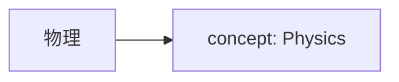

# 物理 Knowledge Network

这页是单学科知识网络的入口。它把原始资料、网页链接、本地资料位置、已沉淀的 wiki 页面和下一步待处理动作放在同一张可维护地图里。

## Current Shape

- Registered raw sources: 0
- Connected wiki pages: 1
- Inbox sources waiting for ingest: 0
- Generated on: 2026-06-19

## How To Add Knowledge

- Web article: `python3 scripts/new_source.py --domain physics --kind article --title "标题" --url "https://..."`
- Local file: `python3 scripts/new_source.py --domain physics --kind paper --title "标题" --local-path "/absolute/path/to/file.pdf"`
- After adding sources, run `python3 scripts/rebuild_domain_network.py` and then `python3 scripts/rebuild_index.py`.
- When a source is important, create or update a `wiki/sources/...` source summary and connect it to concept/entity/analysis pages.

## Knowledge Map

## Concept Graph

## Concept Relations

| Source Concept | Relation | Target Concept | Evidence |
| --- | --- | --- | --- |
| 待补 | 待补 | 待补 | 自动概念抽取后生成 |

## Source Intake

| Status | Kind | Title | Locator | Raw File |
| --- | --- | --- | --- | --- |
| inbox | source | 暂无已登记资料 | 未登记 | `raw/sources/...` |

## Wiki Knowledge Layer

| Type | Title | Summary | Wiki Page |
| --- | --- | --- | --- |
| concept | [Physics](../concepts/physics.md) | 物理学科总览页，用来组织理论分支、模型、实验与和天文学的连接。 | `wiki/concepts/physics.md` |

## Next Network Actions

- Turn high-value `inbox` sources into source summaries.
- Promote recurring terms, methods, people, texts, tools, or datasets into concept/entity pages.
- Add explicit `Related` links between source summaries and concept pages, then rerun lint.
- Mark cross-disciplinary bridge candidates in the related pages instead of duplicating content across domains.

## Cross-Disciplinary Bridge Candidates

- 待补：这个学科中哪些概念需要连接到其他学科？
- 待补：哪些资料适合成为下一阶段跨学科 LLM Wiki 的桥接页面？
