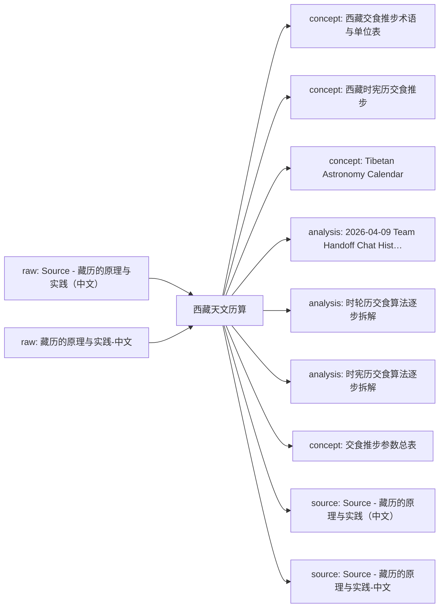

# 西藏天文历算 Knowledge Network

这页是单学科知识网络的入口。它把原始资料、网页链接、本地资料位置、已沉淀的 wiki 页面和下一步待处理动作放在同一张可维护地图里。

## Current Shape

- Registered raw sources: 2
- Connected wiki pages: 9
- Inbox sources waiting for ingest: 0
- Generated on: 2026-06-24

## How To Add Knowledge

- Web article: `python3 scripts/new_source.py --domain tibetan-astronomy-calendar --kind article --title "标题" --url "https://..."`
- Local file: `python3 scripts/new_source.py --domain tibetan-astronomy-calendar --kind paper --title "标题" --local-path "/absolute/path/to/file.pdf"`
- After adding sources, run `python3 scripts/rebuild_domain_network.py` and then `python3 scripts/rebuild_index.py`.
- When a source is important, create or update a `wiki/sources/...` source summary and connect it to concept/entity/analysis pages.

## Knowledge Map

## Concept Graph

## Concept Relations

| Source Concept | Relation | Target Concept | Evidence |
| --- | --- | --- | --- |
| 待补 | 待补 | 待补 | 自动概念抽取后生成 |

## Source Intake

| Status | Kind | Title | Locator | Raw File |
| --- | --- | --- | --- | --- |
| active | source | [Source - 藏历的原理与实践（中文）](../../raw/sources/tibetan-astronomy-calendar/2026/2026-04-07-zangli-principles-practice-zh.md) | 未登记 | `raw/sources/tibetan-astronomy-calendar/2026/2026-04-07-zangli-principles-practice-zh.md` |
| unknown | source | [藏历的原理与实践-中文](../../raw/sources/tibetan-astronomy-calendar/藏历的原理与实践-中文.md) | 未登记 | `raw/sources/tibetan-astronomy-calendar/藏历的原理与实践-中文.md` |

## Wiki Knowledge Layer

| Type | Title | Summary | Wiki Page |
| --- | --- | --- | --- |
| concept | [西藏交食推步术语与单位表](../.archive/concepts/20260624-201352-89205d6f-tibetan-eclipse-terms-and-units.md) | 汇总当前资料中交食推步涉及的时间单位、角度单位、关键术语与方向表达，作为后续算例拆解的公共参考页。 | `wiki/.archive/concepts/20260624-201352-89205d6f-tibetan-eclipse-terms-and-units.md` |
| concept | [西藏时宪历交食推步](../.archive/concepts/20260624-201402-bdb3766a-tibetan-eclipse-calculation.md) | 对西藏时宪历中日月食推步流程的概念化整理，涵盖常数、查表、损益修正、判食限与食时求法。 | `wiki/.archive/concepts/20260624-201402-bdb3766a-tibetan-eclipse-calculation.md` |
| concept | [Tibetan Astronomy Calendar](../.archive/concepts/20260624-202135-53fc9c26-tibetan-astronomy-calendar.md) | 西藏天文历算总览页，用来组织历算规则、周期算法、术语体系、交食推步与相关历史背景。 | `wiki/.archive/concepts/20260624-202135-53fc9c26-tibetan-astronomy-calendar.md` |
| analysis | [2026-04-09 Team Handoff Chat History](../analyses/2026-04-09-team-handoff-chat-history.md) | 对本次 LLM Wiki 搭建与西藏天文历算主题整理过程的会话级交接记录，供切换到 team 模式后继续使用。 | `wiki/analyses/2026-04-09-team-handoff-chat-history.md` |
| analysis | [时轮历交食算法逐步拆解](../analyses/kalachakra-eclipse-step-by-step.md) | 根据当前资料中关于时轮历的直接说明与比较性描述，整理出时轮历交食算法的工作骨架，并明确指出仍需补一份时轮历原始算例。 | `wiki/analyses/kalachakra-eclipse-step-by-step.md` |
| analysis | [时宪历交食算法逐步拆解](../analyses/shixian-eclipse-step-by-step.md) | 将当前资料中的时宪历月食与日食推步流程拆成可阅读的步骤链，便于后续继续细化成参数表、术语表和案例页。 | `wiki/analyses/shixian-eclipse-step-by-step.md` |
| concept | [交食推步参数总表](../concepts/tibetan-eclipse-parameters.md) | 汇总当前资料中时宪历交食推步开头给出的核心常数与其算法角色，便于后续拆算例和做版本比较。 | `wiki/concepts/tibetan-eclipse-parameters.md` |
| source | [Source - 藏历的原理与实践（中文）](../sources/2026-04-07-zangli-principles-practice-zh.md) | 一份以藏传时宪历交食推步为核心的中文资料，包含基本常数、符号表、月全食与日食算例及与现代结果的对照。 | `wiki/sources/2026-04-07-zangli-principles-practice-zh.md` |
| source | [Source - 藏历的原理与实践-中文](../sources/2026-06-17-藏历的原理与实践-中文.md) | 已登记的sources资料，等待补充摘录或正文。 | `wiki/sources/2026-06-17-藏历的原理与实践-中文.md` |

## Next Network Actions

- Turn high-value `inbox` sources into source summaries.
- Promote recurring terms, methods, people, texts, tools, or datasets into concept/entity pages.
- Add explicit `Related` links between source summaries and concept pages, then rerun lint.
- Mark cross-disciplinary bridge candidates in the related pages instead of duplicating content across domains.

## Cross-Disciplinary Bridge Candidates

- 待补：这个学科中哪些概念需要连接到其他学科？
- 待补：哪些资料适合成为下一阶段跨学科 LLM Wiki 的桥接页面？
