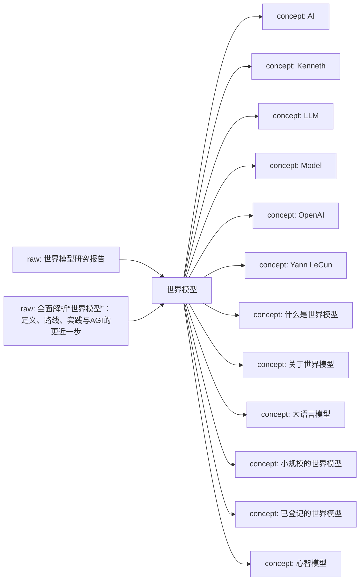
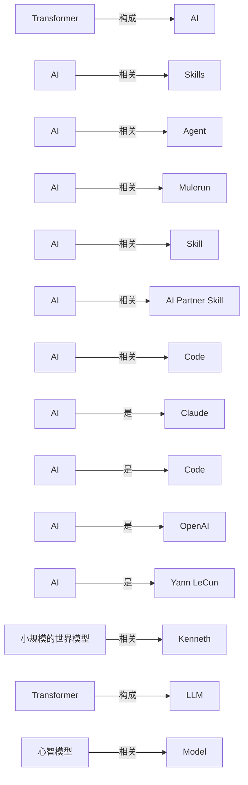

# 世界模型 Knowledge Network

这页是单学科知识网络的入口。它把原始资料、网页链接、本地资料位置、已沉淀的 wiki 页面和下一步待处理动作放在同一张可维护地图里。

## Current Shape

- Registered raw sources: 2
- Connected wiki pages: 16
- Inbox sources waiting for ingest: 0
- Generated on: 2026-06-19

## How To Add Knowledge

- Web article: `python3 scripts/new_source.py --domain 世界模型 --kind article --title "标题" --url "https://..."`
- Local file: `python3 scripts/new_source.py --domain 世界模型 --kind paper --title "标题" --local-path "/absolute/path/to/file.pdf"`
- After adding sources, run `python3 scripts/rebuild_domain_network.py` and then `python3 scripts/rebuild_index.py`.
- When a source is important, create or update a `wiki/sources/...` source summary and connect it to concept/entity/analysis pages.

## Knowledge Map

## Concept Graph

## Concept Relations

| Source Concept | Relation | Target Concept | Evidence |
| --- | --- | --- | --- |
| Transformer | 构成 | AI | [source](../sources/2026-06-17-对transformer的批判2-transformer能输出知识吗.md); evidence: 摘要：“泛BP+Transformer”构成了这一代AI基础架构，泛BP已经被诺贝尔奖封印而昭彰天下，却是个有数十年历史的“资深技术”，有深入理解的人都知道Transformer才是这个魔术的核心道具，LLM的真正“新动能”。 |
| AI | 相关 | Skills | [source](../sources/2026-06-17-agent-skills-终极指南-入门-精通-预测.md); evidence: 巧借通用 Agent 内核，只靠 Skills 设计，就能低成本创造具有通用 AI 智能上限的垂直 Agent 应用。 |
| AI | 相关 | Agent | [source](../sources/2026-06-17-agent-skills-终极指南-入门-精通-预测.md); evidence: 巧借通用 Agent 内核，只靠 Skills 设计，就能低成本创造具有通用 AI 智能上限的垂直 Agent 应用。 |
| AI | 相关 | Mulerun | [source](../sources/2026-06-17-agent-skills-终极指南-入门-精通-预测.md); evidence: 顺便给朋友宇森、付铖的 Mulerun 打个广，他们在做全球性的 Agent 开发与交易市场，即将支持 Creator 用 Skills 开发垂直 Agent，可被用户使用 or 被其他 AI 产品调用。 |
| AI | 相关 | Skill | [source](../sources/2026-06-17-agent-skills-终极指南-入门-精通-预测.md); evidence: 一个好 Skill 能发挥的智能效果，甚至能轻松等同、超越完整的 AI 产品。 |
| AI | 相关 | AI Partner Skill | [source](../sources/2026-06-17-agent-skills-终极指南-入门-精通-预测.md); evidence: 又如 AI Partner Skill，让 通用 Agent 深度学习你的记忆，塑造懂你的 AI 伴侣，给到个性回应。 |
| AI | 相关 | Code | [source](../sources/2026-06-17-万字长文-claude-skills完全指南-从概念到实战.md); evidence: OpenAI的Codex CLI也采用了几乎一样的架构。 |
| AI | 是 | Claude | [source](../sources/2026-06-17-万字长文-claude-skills完全指南-从概念到实战.md); evidence: 用Claude Code自己构建Skills的人是一小撮，但想用AI解决实际问题、又没能力从零创建工作流的人，才是更大的群体。 |
| AI | 是 | Code | [source](../sources/2026-06-17-万字长文-claude-skills完全指南-从概念到实战.md); evidence: 用Claude Code自己构建Skills的人是一小撮，但想用AI解决实际问题、又没能力从零创建工作流的人，才是更大的群体。 |
| AI | 是 | OpenAI | [source](../sources/2026-06-17-全面解析-世界模型-定义-路线-实践与agi的更近一步.md); evidence: 而为了解决这个问题，OpenAI、谷歌、微软等大公司，Yann LeCun、李飞飞等顶尖学者都开始抢着研究同一件事，那就是——世界模型。 |
| AI | 是 | Yann LeCun | [source](../sources/2026-06-17-全面解析-世界模型-定义-路线-实践与agi的更近一步.md); evidence: 而为了解决这个问题，OpenAI、谷歌、微软等大公司，Yann LeCun、李飞飞等顶尖学者都开始抢着研究同一件事，那就是——世界模型。 |
| 小规模的世界模型 | 相关 | Kenneth | [source](../sources/2026-06-17-全面解析-世界模型-定义-路线-实践与agi的更近一步.md); evidence: 1943年，Kenneth Craik在其著作《解释的本质》中就提出：人在对现实作出反应之前，会先在大脑中构建一个“小规模的世界模型”，用它来模拟可能发生的过程，再据此选择行动。 |
| Transformer | 构成 | LLM | [source](../sources/2026-06-17-对transformer的批判2-transformer能输出知识吗.md); evidence: 摘要：“泛BP+Transformer”构成了这一代AI基础架构，泛BP已经被诺贝尔奖封印而昭彰天下，却是个有数十年历史的“资深技术”，有深入理解的人都知道Transformer才是这个魔术的核心道具，LLM的真正“新动能”。 |
| 心智模型 | 相关 | Model | [source](../sources/2026-06-17-全面解析-世界模型-定义-路线-实践与agi的更近一步.md); evidence: 我们能预判下一秒会发生什么，能想象“如果我这么做，会怎么样”，并在脑海中提前排演各种可能性，在认知科学中，这被称为 心智模型（M ental Model） 。 |

## Source Intake

| Status | Kind | Title | Locator | Raw File |
| --- | --- | --- | --- | --- |
| active | article | [世界模型研究报告](../../raw/sources/世界模型/2026/2026-06-17-世界模型研究报告.md) | `/Users/Min369/Documents/同步空间/Manju/AIProjects/ResearchManjusi/LLM Wiki/raw/assets/uploads/世界模型/2026/世界模型研究报告.pdf` | `raw/sources/世界模型/2026/2026-06-17-世界模型研究报告.md` |
| active | article | [全面解析“世界模型”：定义、路线、实践与AGI的更近一步](../../raw/sources/世界模型/2026/2026-06-17-全面解析-世界模型-定义-路线-实践与agi的更近一步.md) | [web](https://mp.weixin.qq.com/s/zTSraDG4fpjK3ADBW7y_-Q) | `raw/sources/世界模型/2026/2026-06-17-全面解析-世界模型-定义-路线-实践与agi的更近一步.md` |

## Wiki Knowledge Layer

| Type | Title | Summary | Wiki Page |
| --- | --- | --- | --- |
| concept | [AI](../concepts/ai.md) | AI 是 ai 知识网络中已保留的概念页，当前定义基于入库资料证据和概念关系，可继续精炼边界与跨学科连接。 | `wiki/concepts/ai.md` |
| concept | [Kenneth](../concepts/kenneth.md) | 从资料《全面解析“世界模型”：定义、路线、实践与AGI的更近一步》自动提取的候选概念，等待人工整理定义、边界和跨学科连接。 | `wiki/concepts/kenneth.md` |
| concept | [LLM](../concepts/llm.md) | LLM 是 ai 知识网络中已保留的概念页，当前定义基于入库资料证据和概念关系，可继续精炼边界与跨学科连接。 | `wiki/concepts/llm.md` |
| concept | [Model](../concepts/model.md) | 从资料《全面解析“世界模型”：定义、路线、实践与AGI的更近一步》自动提取的候选概念，等待人工整理定义、边界和跨学科连接。 | `wiki/concepts/model.md` |
| concept | [OpenAI](../concepts/openai.md) | 从资料《Agent Skills 终极指南：入门、精通、预测》自动提取的候选概念，等待人工整理定义、边界和跨学科连接。 | `wiki/concepts/openai.md` |
| concept | [Yann LeCun](../concepts/yann-lecun.md) | 从资料《全面解析“世界模型”：定义、路线、实践与AGI的更近一步》自动提取的候选概念，等待人工整理定义、边界和跨学科连接。 | `wiki/concepts/yann-lecun.md` |
| concept | [什么是世界模型](../concepts/什么是世界模型.md) | 从资料《全面解析“世界模型”：定义、路线、实践与AGI的更近一步》自动提取的候选概念，等待人工整理定义、边界和跨学科连接。 | `wiki/concepts/什么是世界模型.md` |
| concept | [关于世界模型](../concepts/关于世界模型.md) | 从资料《全面解析“世界模型”：定义、路线、实践与AGI的更近一步》自动提取的候选概念，等待人工整理定义、边界和跨学科连接。 | `wiki/concepts/关于世界模型.md` |
| concept | [大语言模型](../concepts/大语言模型.md) | 从资料《对Transformer的批判2：Transformer能输出知识吗》自动提取的候选概念，等待人工整理定义、边界和跨学科连接。 | `wiki/concepts/大语言模型.md` |
| concept | [小规模的世界模型](../concepts/小规模的世界模型.md) | 从资料《全面解析“世界模型”：定义、路线、实践与AGI的更近一步》自动提取的候选概念，等待人工整理定义、边界和跨学科连接。 | `wiki/concepts/小规模的世界模型.md` |
| concept | [已登记的世界模型](../concepts/已登记的世界模型.md) | 从资料《世界模型研究报告》自动提取的候选概念，等待人工整理定义、边界和跨学科连接。 | `wiki/concepts/已登记的世界模型.md` |
| concept | [心智模型](../concepts/心智模型.md) | 从资料《全面解析“世界模型”：定义、路线、实践与AGI的更近一步》自动提取的候选概念，等待人工整理定义、边界和跨学科连接。 | `wiki/concepts/心智模型.md` |
| concept | [既然人类智能](../concepts/既然人类智能.md) | 从资料《全面解析“世界模型”：定义、路线、实践与AGI的更近一步》自动提取的候选概念，等待人工整理定义、边界和跨学科连接。 | `wiki/concepts/既然人类智能.md` |
| concept | [语言模型](../concepts/语言模型.md) | 从资料《对Transformer的批判2：Transformer能输出知识吗》自动提取的候选概念，等待人工整理定义、边界和跨学科连接。 | `wiki/concepts/语言模型.md` |
| source | [Source - 世界模型研究报告](../sources/2026-06-17-世界模型研究报告.md) | 已登记的世界模型资料，等待补充摘录或正文。 | `wiki/sources/2026-06-17-世界模型研究报告.md` |
| source | [Source - 全面解析“世界模型”：定义、路线、实践与AGI的更近一步](../sources/2026-06-17-全面解析-世界模型-定义-路线-实践与agi的更近一步.md) | 撰稿 ： 张珺玥 如今的AI看起来似乎“无所不能”：能写深奥的论文、复杂的代码，做出顶级的画面和视频。然而，它仍然缺乏 理解世界、预测世界以及在世界里推演并行动的能力。 而为了解决这个问题，OpenAI、谷歌、微软等大公司，Yann LeCun、李飞飞等顶尖学者都开始抢着研究同一件事，那就是——世界模型。 不少AI科学家认为，随着多模态走向普及和成熟，如果… | `wiki/sources/2026-06-17-全面解析-世界模型-定义-路线-实践与agi的更近一步.md` |

## Next Network Actions

- Turn high-value `inbox` sources into source summaries.
- Promote recurring terms, methods, people, texts, tools, or datasets into concept/entity pages.
- Add explicit `Related` links between source summaries and concept pages, then rerun lint.
- Mark cross-disciplinary bridge candidates in the related pages instead of duplicating content across domains.

## Cross-Disciplinary Bridge Candidates

- 待补：这个学科中哪些概念需要连接到其他学科？
- 待补：哪些资料适合成为下一阶段跨学科 LLM Wiki 的桥接页面？
