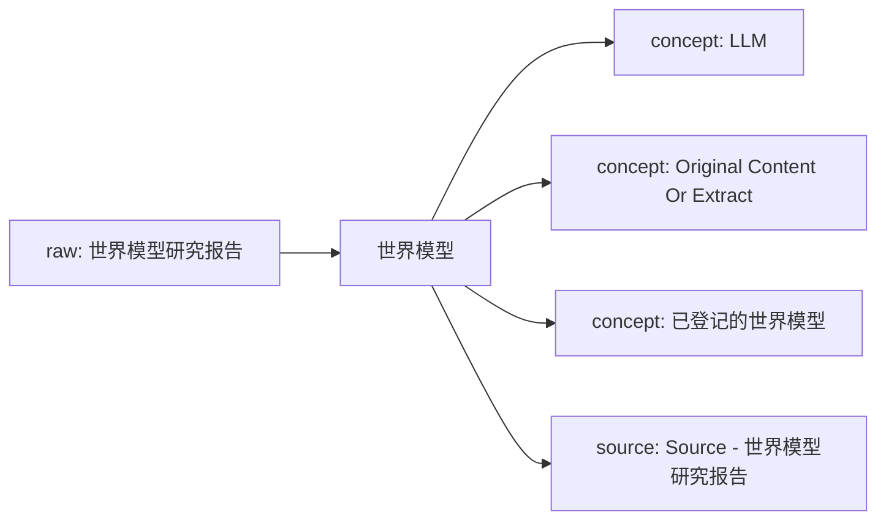
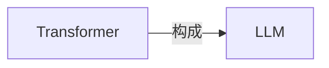

# 世界模型 Knowledge Network

这页是单学科知识网络的入口。它把原始资料、网页链接、本地资料位置、已沉淀的 wiki 页面和下一步待处理动作放在同一张可维护地图里。

## Current Shape

- Registered raw sources: 1
- Connected wiki pages: 4
- Inbox sources waiting for ingest: 0
- Generated on: 2026-06-17

## How To Add Knowledge

- Web article: `python3 scripts/new_source.py --domain 世界模型 --kind article --title "标题" --url "https://..."`
- Local file: `python3 scripts/new_source.py --domain 世界模型 --kind paper --title "标题" --local-path "/absolute/path/to/file.pdf"`
- After adding sources, run `python3 scripts/rebuild_domain_network.py` and then `python3 scripts/rebuild_index.py`.
- When a source is important, create or update a `wiki/sources/...` source summary and connect it to concept/entity/analysis pages.

## Knowledge Map

## Concept Graph

## Concept Relations

| Source Concept | Relation | Target Concept | Evidence |
| --- | --- | --- | --- |
| Transformer | 构成 | LLM | [source](../sources/2026-06-17-对transformer的批判2-transformer能输出知识吗.md); evidence: 摘要：“泛BP+Transformer”构成了这一代AI基础架构，泛BP已经被诺贝尔奖封印而昭彰天下，却是个有数十年历史的“资深技术”，有深入理解的人都知道Transformer才是这个魔术的核心道具，LLM的真正“新动能”。 |

## Source Intake

| Status | Kind | Title | Locator | Raw File |
| --- | --- | --- | --- | --- |
| active | article | [世界模型研究报告](../../raw/sources/世界模型/2026/2026-06-17-世界模型研究报告.md) | `/Users/Min369/Documents/同步空间/Manju/AIProjects/ResearchManjusi/LLM Wiki/raw/assets/uploads/世界模型/2026/世界模型研究报告.pdf` | `raw/sources/世界模型/2026/2026-06-17-世界模型研究报告.md` |

## Wiki Knowledge Layer

| Type | Title | Summary | Wiki Page |
| --- | --- | --- | --- |
| concept | [LLM](../concepts/llm.md) | 从资料《对Transformer的批判2：Transformer能输出知识吗》自动提取的候选概念，等待人工整理定义、边界和跨学科连接。 | `wiki/concepts/llm.md` |
| concept | [Original Content Or Extract](../concepts/original-content-or-extract.md) | 从资料《世界模型研究报告》自动提取的候选概念，等待人工整理定义、边界和跨学科连接。 | `wiki/concepts/original-content-or-extract.md` |
| concept | [已登记的世界模型](../concepts/已登记的世界模型.md) | 从资料《世界模型研究报告》自动提取的候选概念，等待人工整理定义、边界和跨学科连接。 | `wiki/concepts/已登记的世界模型.md` |
| source | [Source - 世界模型研究报告](../sources/2026-06-17-世界模型研究报告.md) | 已登记的世界模型资料，等待补充摘录或正文。 | `wiki/sources/2026-06-17-世界模型研究报告.md` |

## Next Network Actions

- Turn high-value `inbox` sources into source summaries.
- Promote recurring terms, methods, people, texts, tools, or datasets into concept/entity pages.
- Add explicit `Related` links between source summaries and concept pages, then rerun lint.
- Mark cross-disciplinary bridge candidates in the related pages instead of duplicating content across domains.

## Cross-Disciplinary Bridge Candidates

- 待补：这个学科中哪些概念需要连接到其他学科？
- 待补：哪些资料适合成为下一阶段跨学科 LLM Wiki 的桥接页面？
