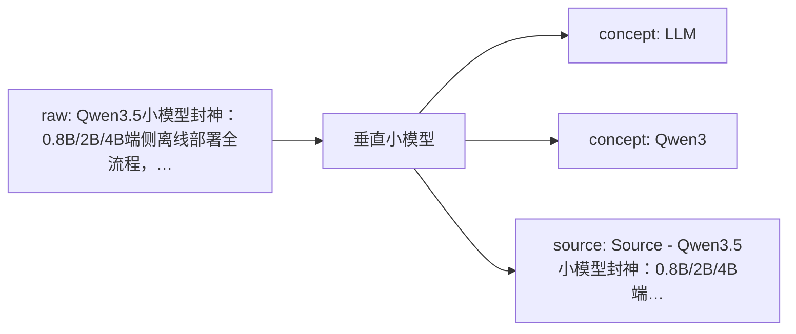
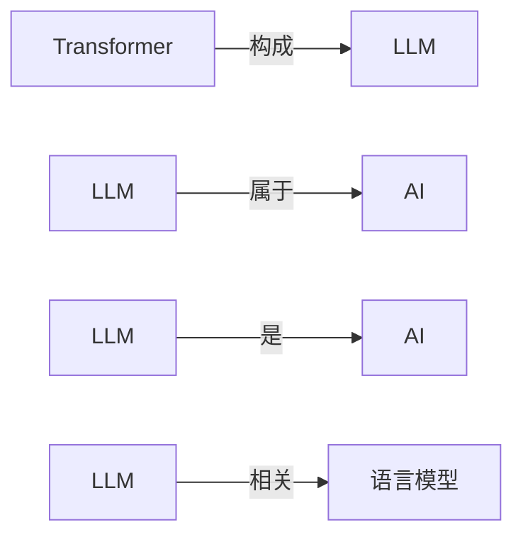

# 垂直小模型 Knowledge Network

这页是单学科知识网络的入口。它把原始资料、网页链接、本地资料位置、已沉淀的 wiki 页面和下一步待处理动作放在同一张可维护地图里。

## Current Shape

- Registered raw sources: 1
- Connected wiki pages: 3
- Inbox sources waiting for ingest: 0
- Generated on: 2026-06-24

## How To Add Knowledge

- Web article: `python3 scripts/new_source.py --domain 垂直小模型 --kind article --title "标题" --url "https://..."`
- Local file: `python3 scripts/new_source.py --domain 垂直小模型 --kind paper --title "标题" --local-path "/absolute/path/to/file.pdf"`
- After adding sources, run `python3 scripts/rebuild_domain_network.py` and then `python3 scripts/rebuild_index.py`.
- When a source is important, create or update a `wiki/sources/...` source summary and connect it to concept/entity/analysis pages.

## Knowledge Map

## Concept Graph

## Concept Relations

| Source Concept | Relation | Target Concept | Evidence |
| --- | --- | --- | --- |
| Transformer | 构成 | LLM | [source](../sources/2026-06-17-对transformer的批判2-transformer能输出知识吗.md); evidence: 摘要：“泛BP+Transformer”构成了这一代AI基础架构，泛BP已经被诺贝尔奖封印而昭彰天下，却是个有数十年历史的“资深技术”，有深入理解的人都知道Transformer才是这个魔术的核心道具，LLM的真正“新动能”。 |
| LLM | 属于 | AI | [source](../sources/2026-06-17-agentic-ai进入正规军时代-读懂agentic-ai全景图与畅想一人公司opc的未来.md); evidence: 如果说去年大家还在为大模型（LLM）的参数量狂欢，那今年整个技术圈的风向已经彻底变了，特别是近期小龙虾OpenClaw的火爆，言必称Agentic AI（代理式人工智能或智能… 自动补充：这份资料属于「ai」资料库，用于补强《Agenti… |
| LLM | 是 | AI | [source](../sources/2026-06-17-agentic-ai进入正规军时代-读懂agentic-ai全景图与畅想一人公司opc的未来.md); evidence: 如果说去年大家还在为大模型（LLM）的参数量狂欢，那今年整个技术圈的风向已经彻底变了，特别是近期小龙虾OpenClaw的火爆，言必称Agentic AI（代理式人工智能或智能体人工智能）。 |
| LLM | 相关 | 语言模型 | [source](../sources/2026-06-17-人工智能的数学革命已经到来.md); evidence: 而在另一些情形中，与ChatGPT、Claude或Gemini等大语言模型的深入对话则催生了全新的证明思路。 |

## Source Intake

| Status | Kind | Title | Locator | Raw File |
| --- | --- | --- | --- | --- |
| active | article | [Qwen3.5小模型封神：0.8B/2B/4B端侧离线部署全流程，手机也能跑](../../raw/sources/垂直小模型/2026/2026-06-17-qwen3-5小模型封神-0-8b-2b-4b端侧离线部署全流程-手机也能跑.md) | 未登记 | `raw/sources/垂直小模型/2026/2026-06-17-qwen3-5小模型封神-0-8b-2b-4b端侧离线部署全流程-手机也能跑.md` |

## Wiki Knowledge Layer

| Type | Title | Summary | Wiki Page |
| --- | --- | --- | --- |
| concept | [LLM](../concepts/llm.md) | LLM 是 ai 知识网络中已保留的概念页，当前定义基于入库资料证据和概念关系，可继续精炼边界与跨学科连接。 | `wiki/concepts/llm.md` |
| concept | [Qwen3](../concepts/qwen3.md) | Qwen3 是 垂直小模型 知识网络中已保留的概念页，当前定义基于入库资料证据和概念关系，可继续精炼边界与跨学科连接。 | `wiki/concepts/qwen3.md` |
| source | [Source - Qwen3.5小模型封神：0.8B/2B/4B端侧离线部署全流程，手机也能跑](../sources/2026-06-17-qwen3-5小模型封神-0-8b-2b-4b端侧离线部署全流程-手机也能跑.md) | 已登记的垂直小模型资料，等待补充摘录或正文。 | `wiki/sources/2026-06-17-qwen3-5小模型封神-0-8b-2b-4b端侧离线部署全流程-手机也能跑.md` |

## Next Network Actions

- Turn high-value `inbox` sources into source summaries.
- Promote recurring terms, methods, people, texts, tools, or datasets into concept/entity pages.
- Add explicit `Related` links between source summaries and concept pages, then rerun lint.
- Mark cross-disciplinary bridge candidates in the related pages instead of duplicating content across domains.

## Cross-Disciplinary Bridge Candidates

- 待补：这个学科中哪些概念需要连接到其他学科？
- 待补：哪些资料适合成为下一阶段跨学科 LLM Wiki 的桥接页面？
